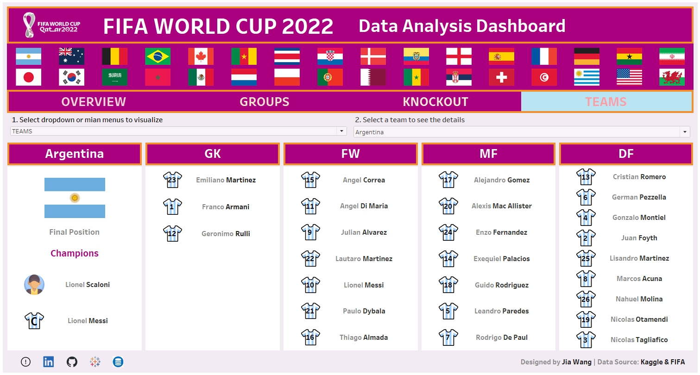

# **FIFA World Cup 2022 Dashboard**

## 1. Introduction
Welcome to my personal project for **FIFA World Cup 2022 dashboard**. It involves data cleaning, Excel formula creation, SQL analysis, Tableau visualization, and personal growth in data analysis and visualization technique, aiming to uncover the valuable insights and trends of the biggest tournament.

The main tools I used though this exploratory Data Analysis project are **EXCEL**, **MySQL** and **Tableau**.
* Tableau Dashboard: [Tableau public](https://public.tableau.com/app/profile/jia.wang3280/viz/FIFAWorldCup2022_16990814009590/Dashboard_1_1).
* Data source: [Kaggle](https://www.kaggle.com/datasets/swaptr/fifa-world-cup-2022-statistics) & [wikipedia](https://en.wikipedia.org/wiki/2022_FIFA_World_Cup#Round_of_16).

## 2. Tableau Data Analysis Dashboard
I crafted a high-quality, interactive Tableau dashboard to visualize diverse tournament data, partitioned into four sections. Utilizing dynamic zone visibility, the dashboard allows the filtering of multiple datasets.
* **Overview**
* **Groups**
* **Knockout**
* **Teams**
 
### 2.1. **Overview**: 
Visualized tournament details, final positions, awards, statistics by teams and players. Designed engaging charts with meaningful tooltips to illustrate the details of tournament statistics.

 

### 2.2. **Groups**:
Utilized dynamic zone visibility to filter each group, detailing information about teams standings, statistics and group stage matches.

 
 

 
### 2.3. **Knockout**:
In the knockout stage, designed a bracket to illustrate specific matches in the Round of 16, quarter-finals, semi-finals, play-off for 3rd place, and the final, including multiple details for each match in tooltips.

 
 

### 2.4. **Teams**:
Filtered players for each team, grouped by positions, and included information about coaches and captains.

 

## 3. Conclusion & Personal Growth
* 123
* 123
* 123
* 123

## 4. Contact info
Thank you for your time to review my project! 
* Tableau Public: [Tableau Public Profile](https://public.tableau.com/app/profile/jia.wang3280/vizzes)
* Linkedln: [Jia Wang Data Analyst](https://www.linkedin.com/in/jiawang-data-analyst/)
* Website: 

